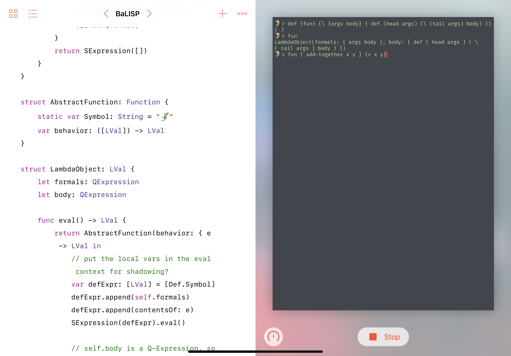

<p align="center">
    
</p>

**Ripley** is a tiny REPL toolkit for Swift Playgrounds for iPad. It provides three public types:
 - `RipleyEngine` - a protocol allowing you to power Ripley with an Eval of your implementation,
 - `RipleyTheme` - a simple struct defining how Ripley should look like,
 - `RipleyViewController` - a Terminal-style view controller you can use for Read and Print operations.

## Usage

To start playing with Ripley, check out this repository on your iPad (e.g. via [Working Copy](https://workingcopyapp.com)) and use Swift Playgrounds "Locations" button to open the `Ripley.playground` via Files.app.  Tap _Run Code_ to build and run Ripley - everything you type, will be echo'd back to you.

To add Ripley to your own Playground:
 1. open the Playground in Working Copy or an editor like [GoCoEdit](https://gocoedit.app),
 1. create a `Sources` directory inside the Playground,
 1. copy `Ripley.swift` over.

There is not much other configuration necessary - simply add a `RipleyTheme`, adopt `RipleyEngine` on your REPL object, set an instance of `RipleyViewController` as your Playground's live view, and you are ready to go!

## Single and multi-line sources

Ripley passes the source as-is to the `eval` method of your choosing. The trigger for eval is a new line character. (i.e. Return on your keyboard) In case you would like to type multi-line sources, escape your newline by appending the `\` to the end of the line. Ripley will remove the backslashes from the resulting source for you.

For example:
```
> def {fun} (\ {args body} {**\**
  def (head args) (\ (tail args) body)**\**
})
```

Will be passed to the `eval` method as:
```
def {fun} (\ {args body} {
  def (head args) (\ (tail args) body)
})
```

## Input history

You can use the up and down arrows on the hardware keyboard attached to your iPad to scroll through the input history. Input history is persisted in a Swift array on a per-runtime basis and can be modified by changing the `inputHistory` variable on the `RipleyViewController`. This is particularly useful for pre-filling snippets that you might need often in your REPL.

## Background

I decided to travel for my most recent vacation with just an iPad. It so happened, that during my trip Bali was both [celebrating Nyepi](https://en.m.wikipedia.org/wiki/Nyepi) and having three days of constant rain. Stuck in a hotel bar, I started working through [Build Your Own Lisp](http://buildyourownlisp.com) and [Crafting Interpreters](http://craftinginterpreters.com). Keeping the little Lisp apps as strings got old really quick, so Ripley is one of the outcomes.

## Enjoy!

I had a lot of fun implementing Ripley. While BaLISP - the Lisp I implemented while vacationing - is not quite ready for public consumption yet, Ripley is pretty much there. If you enjoy using it, let me know [on Twitter](http://twitter.com/giertler)!
